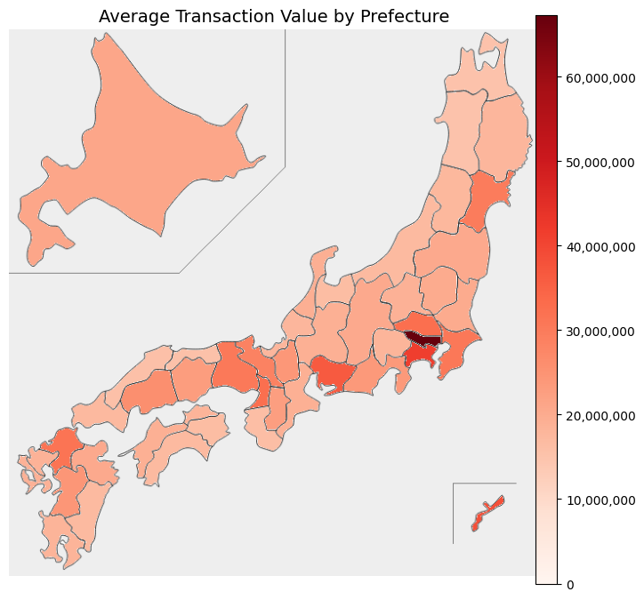

# DATA407 Research Project  
Topic: Estimate the Average House Prices in Japan  

Yuki Isomura  
Student ID: 11888757  

---

## 1. Introduction

### 1.1 Problem Description
Understanding the housing market is crucial for individuals seeking to purchase a home. In Japan, housing prices vary significantly by region, influenced by factors such as location, accessibility, and property characteristics. However, general consumers often lack access to clear and comprehensive indicators that reflect the overall state of the housing market, including properties that are not currently listed or traded. This lack of holistic information makes it challenging for potential buyers to assess how much they might need to spend to purchase a home under typical conditions.

This project aims to estimate the potential national average house price in Japan by combining actual transaction data with the number of existing residential properties in each prefecture. Instead of focusing solely on prices of recently traded properties, the study estimates what the average house price would be if all existing homes were available on the market. This provides a broader and more realistic benchmark for understanding long-term affordability.

### 1.2 Motivation
When purchasing a home, general consumers are often interested not only in how much properties cost in a specific region, but also in how much is typically required to buy a house in Japan as a whole. By estimating regional prices as well as a nationwide average, this study provides a broader benchmark for understanding housing affordability across the country. Consumers can use this information to compare potential relocation options or to assess whether their budget aligns with typical home prices both locally and nationally.

In addition to serving the needs of individual buyers, the estimated potential market price can also support public-sector decision-making. For example, in urban redevelopment projects where local or national governments must relocate residents or acquire residential land, a reliable estimate of average house prices can serve as a reference point. By dividing the potential market value by the average residential floor area, it is possible to approximate the total financial scale of such relocation or compensation plans. This enables more informed budgeting and strategic planning.

Ultimately, this study aims to provide a meaningful indicator that benefits both general consumers and policymakers by offering a comprehensive and data-driven view of Japan’s housing landscape, from regional price patterns to national affordability benchmarks.

--- 

## 2. Method

This study employs two statistical approaches to estimate the potential national average house price in Japan: **Method A (Ratio Estimation)** and **Method B (Cluster-Based Weighted Estimation)**. Both methods rely on real transaction data and incorporate housing stock information to produce a more comprehensive estimate that reflects the distribution of homes across regions.

### 2.1 Data Sources

This analysis is based on two primary datasets:

1. **Real Estate Transaction Data**  
   Collected from the Ministry of Land, Infrastructure, Transport, and Tourism (MLIT), this dataset includes detailed records of past residential property transactions across Japan. It contains information such as property type, location, price, area, and transaction date.

2. **Prefectural Housing Stock Data**  
   Obtained from the Statistics of Japan, this dataset provides the total number of residential properties in each prefecture. It is used to weight average prices in both methods.

### 2.2 Data Preprocessing

To ensure the reliability and accuracy of the national average house price estimate, several preprocessing steps were implemented on both the real estate transaction data and the housing stock statistics.

#### Multi-Year Averaging for Price Estimation

The average transaction price per prefecture (\( \bar{x}_i \)) was computed using data collected over a five-year period from 2019 to 2023. This multi-year averaging approach reduces the influence of short-term economic shocks—such as the COVID-19 pandemic—and captures a more stable representation of typical residential prices. Given that residential properties are not typically purchased on an annual basis, this method better reflects long-term affordability trends.

To ensure statistical robustness, a minimum of 200 transaction records per prefecture per year was confirmed. As a result, each prefecture included in the analysis contains over 1,000 transaction records, which suppresses estimation variance in \( \bar{x}_i \) and enhances precision.

- Raw Data: [Real Estate Transaction Records](https://github.com/yukiiso/DATA407_HousePriceAnalysis/tree/main/data/raw/housing_market)
- Processed Aggregates: [Prefectural Summary Table](https://github.com/yukiiso/DATA407_HousePriceAnalysis/blob/main/data/processed/housing_market_japan.csv)

#### Fixed Housing Stock Weights

The housing stock values (\( w_i \)) were treated as fixed quantities due to the lack of available variance information in the source data. The official statistics, published by the [Statistics of Japan](https://www.e-stat.go.jp/en/dbview?sid=0004021440), do not report sampling error or methodological details regarding how the housing counts were collected or estimated. 

To align the analysis with the goal of estimating present-day price levels, the most recent available data (2023) was used for the housing stock.

- Raw Data: [Housing and Land Survey (e-Stat)](https://github.com/yukiiso/DATA407_HousePriceAnalysis/blob/main/data/raw/FEH_00200522_250404040141.csv)
- Processed Aggregates: [Prefectural Housing Stock CSV](https://github.com/yukiiso/DATA407_HousePriceAnalysis/blob/main/data/processed/prefecture_housing_stock.csv)

#### Transaction Data Cleaning and Preparation

Several additional preprocessing steps were applied to improve data quality:

- **Filtering**: Non-residential properties, including commercial and industrial land, were excluded to retain only residential transaction records.
- **Feature Selection**: Redundant and irrelevant variables were removed to streamline the dataset and reduce complexity.
- **Missing Values**: Entries with missing values in key variables (e.g., transaction price, area, or structure) were excluded from the analysis.
- **Outlier Removal**: The top and bottom 1% of the transaction price distribution were removed to mitigate the effect of extreme values.

The complete cleaning pipeline and implementation details are documented in the following notebook:
- [01_data_cleaning.ipynb](https://github.com/yukiiso/DATA407_HousePriceAnalysis/blob/main/notebooks/01_data_cleaning.ipynb)

### 2.3 Method A: Ratio Estimation based on Prefectural Housing Stock

In this method, the national average house price is calculated using the average transaction price in each prefecture, weighted by the number of existing residential properties (housing stock) in that prefecture. This approach assumes that the observed transaction data is representative of the broader housing stock in each region.

#### Formula and Variable Definitions
Let:
- \( \bar{x}_i \): the average transaction price in prefecture \( i \), calculated as the five-year average from 2019 to 2023. This value reflects long-term price trends by smoothing out short-term volatility such as economic shocks.
- \( w_i \): the total number of residential properties in prefecture \( i \), based on the 2023 housing stock statistics. As explained previously, these values are treated as fixed constants due to the absence of reported sampling error.
- \( \sigma_i^2 \): the variance of transaction prices in prefecture \( i \).
- \( n_i \): the number of transaction records in prefecture \( i \).
- \( N \): the number of prefectures.

Then, the weighted national average is given by:

\[ \hat{\mu}_{\text{Ratio}} = \frac{\sum_{i=1}^{N} \bar{x}_i \cdot w_i}{\sum_{i=1}^{N} w_i} \]

The standard error (SE) of this estimator is:

\[ SE(\hat{\mu}_{\text{Ratio}}) = \sqrt{ \frac{ \sum_{i=1}^{N} w_i^2 \cdot \sigma_i^2 / n_i }{ (\sum_{i=1}^{N} w_i)^2 } } \]

The corresponding 95% confidence interval is:

\[ CI = \hat{\mu}_{\text{Ratio}} \pm 1.96 \times SE(\hat{\mu}_{\text{Ratio}}) \]

#### Purpose and Advantages
This method is appropriate because:
- It directly reflects the actual distribution of housing stock across prefectures.
- Each prefecture contributes to the national average in proportion to its real-world prevalence.
- With sufficient sample sizes in each prefecture, the estimator is statistically efficient and unbiased.

Furthermore, as visualized in the map below, the number of transaction records varies significantly by prefecture. This highlights the importance of weighting each region appropriately—without proper weighting, prefectures with a disproportionately high number of transactions (such as Tokyo or Osaka) could exert an outsized influence on the estimated national average, skewing the result. Ratio estimation corrects for this by ensuring that each prefecture’s contribution is proportional to its housing stock, not just the volume of available data.


---

### 2.4 Method B: Cluster-Based Weighted Estimation

In this method, prefectures are grouped into clusters based on their average transaction prices using an unsupervised clustering algorithm. For each cluster, the average house price is calculated by aggregating the average prices of its member prefectures. Then, the national average is estimated by weighting these cluster means according to the total housing stock within each cluster.

The clustering is based on price levels, so prefectures with similar average housing prices are grouped together. This captures structural patterns in the regional housing market.

#### Formula and Variable Definitions
Let:
- \( C_k \): the set of prefectures in cluster \( k \), formed based on similarities in average transaction prices.
- \( \bar{x}_i \): the average transaction price in prefecture \( i \in C_k \), as previously defined (five-year average).
- \( w_i \): the housing stock in prefecture \( i \in C_k \), from the 2023 statistics.
- \( \bar{x}_k \): the cluster-level average price, computed as the weighted mean of member prefectures.
- \( W_k \): the total housing stock in cluster \( k \).
- \( \hat{\mu}_{\text{Cluster}} \): the estimated national average price using cluster-level aggregation.
- \( \sigma_k^2 \): the within-cluster variance.
- \( n_k \): the number of transaction records in cluster \( k \).
- \( K \): the total number of clusters.

Then, the cluster-level statistics and national estimate are given by:

\[ \bar{x}_k = \frac{\sum_{i \in C_k} \bar{x}_i \cdot w_i}{\sum_{i \in C_k} w_i} \]
\[ W_k = \sum_{i \in C_k} w_i \]
\[ \hat{\mu}_{\text{Cluster}} = \frac{\sum_{k=1}^{K} \bar{x}_k \cdot W_k}{\sum_{k=1}^{K} W_k} \]

The standard error is estimated as:

\[ SE(\hat{\mu}_{\text{Cluster}}) = \sqrt{ \frac{ \sum_{k=1}^{K} W_k^2 \cdot \sigma_k^2 / n_k }{ (\sum_{k=1}^{K} W_k)^2 } } \]

And the 95% confidence interval:

\[ CI = \hat{\mu}_{\text{Cluster}} \pm 1.96 \times SE(\hat{\mu}_{\text{Cluster}}) \]

#### Purpose and Advantages
This method is useful when:
- There is significant regional variability in prices, and clustering helps smooth out noise.
- The exact representativeness of individual prefectures is uncertain, but broader groupings (e.g., "high-price regions") are more stable.
- Clustering introduces robustness by averaging within groups that share similar market characteristics.

The clustering is performed using the K-means algorithm, which is suitable in this context due to its efficiency, interpretability, and effectiveness in separating groups based on a single numerical feature (price). Compared to other clustering methods such as hierarchical clustering or DBSCAN, K-means is computationally scalable and produces balanced partitions when the variable of interest (transaction price) exhibits clear groupings, as observed in the data.

Although Method B may slightly reduce variance by aggregation, it comes at the cost of ignoring some regional heterogeneity. Therefore, it complements but does not replace Method A.

---

## 3. Simulation
### 3.1 Effectiveness of Method A (Ratio Estimation)

This simulation demonstrates that when sample sizes are imbalanced across groups (e.g., regions or prefectures), a naive average of all samples can be biased toward groups with more data. In contrast, **Method A (Ratio Estimation)** uses known population-level weights (e.g., housing stock) to correctly estimate the national average.

We generate synthetic data with:
- 10 groups, each with its own true average house price
- Different sample sizes per group to simulate data imbalance
- Known housing stock weights per group

We then compare:
- The **true national average** (based on true group means and weights)
- The **naive sample mean** (ignoring group imbalance)
- The **weighted estimate** using Method A

```python
import numpy as np
import pandas as pd
import matplotlib.pyplot as plt

np.random.seed(11888757)

# Define 10 synthetic groups (e.g., regions or prefectures)
groups = [f"Group_{i}" for i in range(10)]

# Assign a true average price (μ) to each group, between 20M and 60M yen
true_means = np.random.uniform(2000, 6000, size=10)

# Define the true housing stock weights (population-level weights)
true_weights = np.random.randint(1000, 5000, size=10)
true_weights = true_weights / true_weights.sum()  # Normalize to sum to 1

# Assign sample sizes for each group (to simulate data imbalance)
sample_sizes = np.random.randint(100, 10000, size=10)

# Generate synthetic transaction data for each group
data = []
for i in range(10):
    mu = true_means[i]
    sigma = mu * 0.1  # Add 10% noise
    n = sample_sizes[i]
    samples = np.random.normal(mu, sigma, size=n)
    for value in samples:
        data.append({
            'group': groups[i],
            'value': value
        })

df = pd.DataFrame(data)

# Calculate the sample mean for each group
group_means = df.groupby("group")["value"].mean()

# Naive sample mean (ignores imbalance in sample sizes)
naive_mean = df["value"].mean()

# Ratio Estimation (Method A): use group means and population weights
weighted_mean = sum(group_means[g] * true_weights[i] for i, g in enumerate(groups))

# Ground truth: weighted average using true means and true weights
true_national_mean = sum(true_means * true_weights)

# Display results
print(f"True National Average:       {true_national_mean:.2f}")
print(f"Naive Sample Mean:           {naive_mean:.2f}")
print(f"Weighted Estimate (Method A): {weighted_mean:.2f}")
```
Output: 
```
True National Average:       3773.78
Naive Sample Mean:           4041.12
Weighted Estimate (Method A): 3773.99
```
#### Result Interpretation

The results clearly show that the **naive sample mean** overestimates the true national average due to sample imbalance. Groups with larger sample sizes have a disproportionate influence, even if they are not proportionally large in the actual housing stock.

In contrast, **Method A (Ratio Estimation)** produces a result very close to the **true national average**, confirming that applying proper weights based on housing stock is essential for an accurate and unbiased estimation.

This supports the validity of using ratio estimation when transaction data is unevenly distributed across regions.

--- 

### 3.2 When Method B Results in a Narrower Confidence Interval

This simulation demonstrates a scenario in which **Method B (cluster-based estimation)** achieves a **narrower confidence interval (CI)** than **Method A (group-based estimation)**.

To create such a case:
- A synthetic population of 12 groups was constructed, deliberately divided into three clearly distinct clusters:  
  **Low price (~2000), Mid price (~5000), and High price (~10000).**
- Each group contains a sample drawn from a normal distribution centered around its true mean with moderate noise (10% of mean).
- Both Method A and Method B were applied to estimate the national average price and calculate their confidence intervals.

This setup reflects a market where regional price differences are substantial and cluster structures are meaningful.

```python
import numpy as np
import pandas as pd
from sklearn.cluster import KMeans

np.random.seed(11888757)

# Step 1: Define 3 very clear clusters in true_means
num_groups = 12
group_ids = [f"G{i}" for i in range(num_groups)]

# Cluster 1: 2000〜2200, Cluster 2: 4000〜4200, Cluster 3: 8000〜8200
true_means = np.array([
    2000, 2020, 2040, 2060,     # Cluster 0: Low
    5000, 5020, 5040, 5060,     # Cluster 1: Mid
    10000, 10020, 10040, 10060  # Cluster 2: High
])
true_weights = np.random.randint(1000, 5000, size=num_groups)
true_weights = true_weights / true_weights.sum()

# Step 2: Generate sample data with *very* low variance
sample_sizes = np.random.randint(1000, 3000, size=num_groups)
data = []

for i in range(num_groups):
    mu = true_means[i]
    sigma = mu * 0.1  # noise (10%)
    n = sample_sizes[i]
    samples = np.random.normal(mu, sigma, size=n)
    for val in samples:
        data.append({'group': group_ids[i], 'value': val})

df = pd.DataFrame(data)

# Step 3: Compute group-level statistics
group_stats = df.groupby("group").agg(
    sample_mean=('value', 'mean'),
    sample_var=('value', 'var'),
    n=('value', 'count')
).reset_index()
group_stats['true_mean'] = true_means
group_stats['weight'] = true_weights

# Step 4: Method A (group-based)
def method_a(df):
    wm = np.sum(df['sample_mean'] * df['weight'])
    se = np.sqrt(np.sum((df['weight']**2 * df['sample_var']) / df['n']))
    ci = (wm - 1.96 * se, wm + 1.96 * se)
    return wm, se, ci

mean_a, se_a, ci_a = method_a(group_stats)

# Step 5: Cluster formation (KMeans on sample_mean)
kmeans = KMeans(n_clusters=3, random_state=0)
group_stats['cluster'] = kmeans.fit_predict(group_stats[['sample_mean']])

# Step 6: Compute cluster-level stats with weighted average
cluster_stats = []

for cluster_id, sub_df in group_stats.groupby("cluster"):
    cluster_mean = np.average(sub_df['sample_mean'], weights=sub_df['weight'])  
    cluster_weight = sub_df['weight'].sum()
    values = df[df['group'].isin(sub_df['group'])]['value']
    cluster_var = np.var(values, ddof=1)
    cluster_n = len(values)

    cluster_stats.append({
        'cluster': cluster_id,
        'mean': cluster_mean,
        'var': cluster_var,
        'n': cluster_n,
        'weight': cluster_weight
    })

cluster_df = pd.DataFrame(cluster_stats)

# Step 7: Method B (cluster-based)
def method_b(df):
    wm = np.sum(df['mean'] * df['weight'])
    se = np.sqrt(np.sum((df['weight']**2 * df['var']) / df['n']))
    ci = (wm - 1.96 * se, wm + 1.96 * se)
    return wm, se, ci

mean_b, se_b, ci_b = method_b(cluster_df)

# Step 8: True national mean
true_mean = np.sum(true_means * true_weights)

# Step 9: Output
print(f"True mean: {true_mean:.2f}\n")

print("=== Method A (Group-based) ===")
print(f"Mean: {mean_a:.2f}")
print(f"SE:   {se_a:.2f}")
print(f"95% CI: ({ci_a[0]:.2f}, {ci_a[1]:.2f})")
print(f"Distance from true mean: {abs(mean_a - true_mean):.2f}\n")

print("=== Method B (Cluster-based) ===")
print(f"Mean: {mean_b:.2f}")
print(f"SE:   {se_b:.2f}")
print(f"95% CI: ({ci_b[0]:.2f}, {ci_b[1]:.2f})")
print(f"Distance from true mean: {abs(mean_b - true_mean):.2f}")
```

Output:
```
True mean: 6081.67

=== Method A (Group-based) ===
Mean: 6146.97
SE:   5.01
95% CI: (6137.15, 6156.79)
Distance from true mean: 65.30

=== Method B (Cluster-based) ===
Mean: 6146.97
SE:   4.83
95% CI: (6137.51, 6156.43)
Distance from true mean: 65.30
```

#### Result Interpretation

While both methods slightly overestimated the true mean due to noise, **Method B yielded a marginally narrower confidence interval**.

This result supports the theoretical claim that:
> "Clustering similar groups can reduce within-cluster variance, leading to a smaller overall standard error and narrower confidence intervals — provided that the clusters are well-defined and internally consistent."

Such structure-aware estimation may be useful in real-world housing market analysis, where price segmentation across regions can be clearly observed.

It is important to note that this simulation represents only one illustrative example. Depending on the value of \( K \) (the number of clusters) and the random seed used for initialization, the advantage of Method B over Method A can become more pronounced. In some configurations, the gap in confidence intervals may be significantly larger. Therefore, this experiment serves as a **proof of concept** that Method B can outperform Method A in scenarios where meaningful cluster structures exist in the data.


## 4. Real Data Analysis

This section applies two estimation methods to the real estate transaction dataset, after first aggregating the data at the prefectural level. The process includes preparing and visualizing the data, followed by implementing both Method A (Ratio Estimation) and Method B (Cluster-Based Weighted Estimation) to compare their results.

### 4.1 Constructing the DataFrame

Initially, a prefecture-level summary is created from the raw dataset and then merged with the housing stock information. The resulting `df_prefecture_stats` contains each prefecture’s average transaction price, standard error (SE), housing stock, and other relevant fields.

**Key Points**  
- The DataFrame `df` contains all real estate transactions, with each row representing a single record.  
- The DataFrame `df_housing_stock` contains the housing stock for each prefecture.  

```python
# Create a new data frame with the number of data, mean, and SE (standard error) for each prefecture
df_prefecture_stats = (
    df.groupby("Prefecture")["Total transaction value"]
    .agg(
        Count="size",
        Mean="mean",
        SE=lambda x: x.std(ddof=1) / np.sqrt(len(x))
    )
    .reset_index()
)

# Read the CSV file that contains housing stock data
df_housing_stock = pd.read_csv("../data/processed/prefecture_housing_stock.csv")

# Merge the two DataFrames on "Prefecture" (merge result directly into df_prefecture_stats)
df_prefecture_stats = pd.merge(
    df_prefecture_stats,
    df_housing_stock,
    on="Prefecture",
    how="left"
)

df_prefecture_stats.rename(columns={"Total": "Stock"}, inplace=True)

# Convert "Mean" to float
df_prefecture_stats["Mean"] = pd.to_numeric(
    df_prefecture_stats["Mean"], errors="coerce"
)
```

### 4.2 Visualizing the Average Transaction Price by Prefecture
Once the DataFrame is prepared, the average transaction price can be plotted on a map to observe regional differences. 


### 4.3 Method A: Ratio Estimation
Next, Method A (Ratio Estimation) is employed. A national average price is calculated by taking the weighted mean of each prefecture’s average price, with housing stock serving as the weight. The following formulas illustrate the approach:
\[
\hat{\mu}_{\text{Ratio}} 
= \frac{\sum_{i=1}^N w_i \cdot \bar{x}_i}{\sum_{i=1}^N w_i},
\quad
SE(\hat{\mu}_{\text{Ratio}}) 
= \sqrt{
  \frac{\sum_{i=1}^N w_i^2 \cdot SE_i^2}{
    \left(\sum_{i=1}^N w_i\right)^2
  }
}.
\]

```python
# 1. Compute the total housing stock across all prefectures
W = df_prefecture_stats["Stock"].sum()

# 2. Calculate the weighted mean (Ratio Estimation)
weighted_mean = (
    (df_prefecture_stats["Mean"] * df_prefecture_stats["Stock"]).sum() 
    / W
)

# 3. Calculate the variance of the weighted mean
variance = (
    (df_prefecture_stats["Stock"] ** 2) 
    * (df_prefecture_stats["SE"] ** 2)
).sum() / (W ** 2)

# 4. Standard error is the square root of the variance
std_error = np.sqrt(variance)

# 5. 95% confidence interval
ci_lower = weighted_mean - 1.96 * std_error
ci_upper = weighted_mean + 1.96 * std_error

# 6. Print or display the results
print("Weighted Mean (Method A):", weighted_mean)
print("Standard Error (Method A):", std_error)
print("95% CI (Method A): [{:.3f}, {:.3f}]".format(ci_lower, ci_upper))
```

Output: 
```
Weighted Mean (Method A): 32079104.73195155
Standard Error (Method A): 51653.575027348095
95% CI (Method A): [31977863.725, 32180345.739]
```
### 4.4 Method B: Cluster-Based Weighted Estimation
In Method B, an unsupervised clustering algorithm (KMeans, in this example) groups prefectures with similar average prices. Cluster-level average prices are then calculated, again weighted by the housing stock. Furthermore, each cluster’s variance is derived from the raw data, rather than relying solely on prefectural-level SE values, which can yield a more robust estimate.

```python
best_result = None
min_se = float("inf")

for K in range(1, 11):
    # 1. Cluster the prefectures based on Mean price
    X = df_prefecture_stats[["Mean"]].values
    kmeans = KMeans(n_clusters=K, random_state=11888757, n_init="auto")
    df_prefecture_stats["Cluster"] = kmeans.fit_predict(X)

    # 2. Compute cluster-level stats
    cluster_stats = []
    for k in range(K):
        prefectures_in_cluster = df_prefecture_stats.loc[
            df_prefecture_stats["Cluster"] == k, "Prefecture"
        ]
        cluster_df = df_prefecture_stats[df_prefecture_stats["Cluster"] == k]
        W_k = cluster_df["Stock"].sum()
        if W_k == 0:
            continue
        cluster_mean_k = (
            (cluster_df["Mean"] * cluster_df["Stock"]).sum() / W_k
        )
        df_cluster_raw = df[df["Prefecture"].isin(prefectures_in_cluster)]
        n_k = len(df_cluster_raw)
        if n_k <= 1:
            sigma_k_sq = 0.0
        else:
            sigma_k_sq = df_cluster_raw["Total transaction value"].var(ddof=1)
        cluster_stats.append({
            "Cluster": k,
            "ClusterMean": cluster_mean_k,
            "W_k": W_k,
            "sigma_k_sq": sigma_k_sq,
            "n_k": n_k
        })

    df_clusters = pd.DataFrame(cluster_stats)

    # 3. Combine cluster means -> national mean
    W_total = df_clusters["W_k"].sum()
    numerator = (df_clusters["ClusterMean"] * df_clusters["W_k"]).sum()
    mu_cluster = numerator / W_total

    # 4. Compute standard error (Method B style)
    df_clusters["Var_mean_k"] = df_clusters.apply(
        lambda row: row["sigma_k_sq"] / row["n_k"] if row["n_k"] > 0 else 0.0,
        axis=1
    )
    var_mu_cluster = (
        (df_clusters["W_k"] ** 2) * df_clusters["Var_mean_k"]
    ).sum() / (W_total ** 2)
    se_mu_cluster = np.sqrt(var_mu_cluster)

    # 5. Save the best one
    if se_mu_cluster < min_se:
        min_se = se_mu_cluster
        best_result = {
            "K": K,
            "df_clusters": df_clusters.copy(),
            "mu_cluster": mu_cluster,
            "se_mu_cluster": se_mu_cluster,
            "ci_lower": mu_cluster - 1.96 * se_mu_cluster,
            "ci_upper": mu_cluster + 1.96 * se_mu_cluster
        }

# 6. Output best result
print("=== Cluster-Based Weighted Estimation (Method B) ===")
print(f"Number of Clusters: {best_result['K']}")
print("\nCluster Details:")
print(best_result["df_clusters"])

print("\nNational Estimate (Method B):")
print(f"Weighted Mean: {best_result['mu_cluster']:.3f}")
print(f"Standard Error: {best_result['se_mu_cluster']:.3f}")
print(f"95% CI: [{best_result['ci_lower']:.3f}, {best_result['ci_upper']:.3f}]")
```
Output: 
```
=== Cluster-Based Weighted Estimation (Method B) ===
Number of Clusters: 2

Cluster Details:
   Cluster   ClusterMean       W_k    sigma_k_sq     n_k    Var_mean_k
0        0  1.995205e+07  28039000  2.982157e+14  198046  1.505790e+09
1        1  4.126713e+07  37008000  1.597765e+15  277185  5.764255e+09

National Estimate (Method B):
Weighted Mean: 32079104.732
Standard Error: 46321.218
95% CI: [31988315.144, 32169894.320]
```

### 4.5 Comparing the Results

The national average estimated from both Method A (simple weighted average across prefectures) and Method B (cluster-based weighted average) resulted in virtually the same point estimate:

- **Method A Weighted Mean**: ¥32,079,104.73  
- **Method B Weighted Mean**: ¥32,079,104.73  

However, the standard errors differed slightly:

- **Method A Standard Error**: ¥51,653.58  
- **Method B Standard Error**: ¥46,321.22  

This suggests that while the two methods converge to the same average price, Method B provides a **smaller standard error**, indicating higher statistical efficiency. Method B achieved this by partitioning the data into two clusters based on prefectural mean prices, and computing a weighted estimate that incorporates intra-cluster variance.

Clustering helps in capturing regional heterogeneity, particularly when some prefectures differ substantially in market behavior. By aggregating the data in this structured way, Method B reduces the sensitivity to local outliers and sampling noise.

The equivalence in the average values is not coincidental, but follows directly from the mathematical structure of both estimators. Method A computes the national average as:

\[
\hat{\mu}_{\text{Ratio}} = \frac{\sum_{i=1}^{N} \bar{x}_i \cdot w_i}{\sum_{i=1}^{N} w_i}
\]

Meanwhile, Method B aggregates the prefectures into \( K \) clusters and calculates:

\[
\bar{x}_k = \frac{\sum_{i \in C_k} \bar{x}_i \cdot w_i}{\sum_{i \in C_k} w_i}, \quad
W_k = \sum_{i \in C_k} w_i, \quad
\hat{\mu}_{\text{Cluster}} = \frac{\sum_{k=1}^{K} \bar{x}_k \cdot W_k}{\sum_{k=1}^{K} W_k}
\]

Substituting \( \bar{x}_k \) into the national estimate:

\[
\hat{\mu}_{\text{Cluster}} = \frac{\sum_{k=1}^{K} \left( \frac{\sum_{i \in C_k} \bar{x}_i \cdot w_i}{\sum_{i \in C_k} w_i} \cdot \sum_{i \in C_k} w_i \right)}{\sum_{i=1}^{N} w_i}
= \frac{\sum_{i=1}^{N} \bar{x}_i \cdot w_i}{\sum_{i=1}^{N} w_i}
= \hat{\mu}_{\text{Ratio}}
\]

Thus, **both estimators are guaranteed to yield the same national average**, as long as the cluster assignments in Method B are exhaustive and non-overlapping. The distinction lies in how uncertainty is quantified. In this analysis, **Method B outperformed Method A** by producing a lower standard error while maintaining the same point estimate, making it the preferred approach when cluster-level structure is meaningful and available.


## 5. Conclusions and Discussion
This study presented two complementary approaches to estimating Japan’s national average house price: Method A (Ratio Estimation) and Method B (Cluster-Based Weighted Estimation). Both methods produced a national average of approximately ¥32,079,105, demonstrating consistency in the estimation framework and underlying data.

The estimated standard errors, however, differed slightly. Method A yielded a standard error of approximately ¥51,654, while Method B achieved a lower value of about ¥46,321. Although the difference is modest, the smaller standard error from Method B indicates greater statistical efficiency, achieved by grouping prefectures into clusters based on similar average price levels. This structured aggregation helps reduce sensitivity to regional outliers and sampling variability.

For general consumers, the findings offer a concrete benchmark for understanding home affordability on a national level. While most buyers naturally focus on local markets, having a reliable national reference—anchored in actual transaction data and weighted by housing stock—enables individuals to assess how their target areas compare to the broader landscape. The relatively narrow confidence interval (approximately ¥31.99 million to ¥32.17 million) further reinforces the reliability of the estimate for practical decision-making, such as budgeting, relocation, or long-term financial planning.

From a policy and planning perspective, these estimates are particularly valuable. Government agencies involved in urban planning, redevelopment, or public housing policy can use the national average as a credible input when forecasting costs or designing compensation frameworks. Knowing that the typical house price lies in the low-¥32 million range provides a concrete and actionable figure for large-scale project planning. The overall stability of results across methods strengthens their utility for long-term decision-making and allocation of public resources.

While this report emphasized the national average, the analysis also provides meaningful insights at the prefectural level. These regional estimates enable individuals and investors to make more localized assessments by comparing prices against their budget, lifestyle goals, or job opportunities. Used in conjunction with qualitative considerations such as infrastructure, amenities, and accessibility, the prefecture-level data can support more personalized and informed housing decisions.

In conclusion, both estimation methods point to a national average house price of approximately ¥32 million, offering a dependable reference for private and public stakeholders alike. Method B is particularly suitable when higher precision is desired, as it achieves a lower standard error through cluster-based variance reduction. These findings can serve as a reliable foundation for transparent, data-driven housing decisions and policies throughout Japan.

## 6. References
- Ministry of Land, Infrastructure, Transport and Tourism (MLIT). [Real Estate Transaction Price Information](https://www.reinfolib.mlit.go.jp/realEstatePrices/). Accessed March 2025.

- e-Stat. [Portal Site of Official Statistics of Japan: Housing and Land Survey](https://www.e-stat.go.jp/en/dbview?sid=0004021440). Accessed March 2025.

- Pedregosa, F., Varoquaux, G., Gramfort, A., Michel, V., Thirion, B., Grisel, O., ... & Duchesnay, E. (2011). Scikit-learn: Machine Learning in Python. *Journal of Machine Learning Research*, 12, 2825–2830.

- Saito, T. (n.d.). *japanmap* [Computer software]. GitHub. https://github.com/SaitoTsutomu/japanmap


