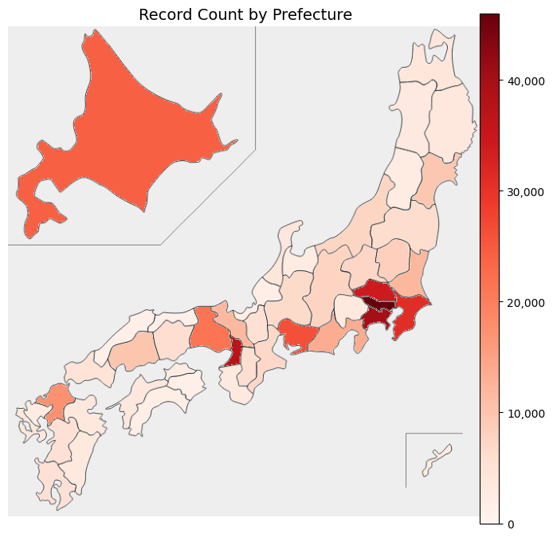

# DATA407 Research Project 
## Topic: Estimate the average house prices in Japan

## 1. Introduction

### 1.1 Problem Description
Understanding the housing market is crucial for individuals seeking to purchase a home. In Japan, housing prices vary significantly by region, influenced by factors such as location, accessibility, and property characteristics. However, general consumers often lack access to clear and comprehensive indicators that reflect the overall state of the housing market, including properties that are not currently listed or traded. This lack of holistic information makes it challenging for potential buyers to assess how much they might need to spend to purchase a home under typical conditions.

This project aims to estimate the potential national average house price in Japan by combining actual transaction data with the number of existing residential properties in each prefecture. Instead of focusing solely on prices of recently traded properties, the study estimates what the average house price would be if all existing homes were available on the market. This provides a broader and more realistic benchmark for understanding long-term affordability.


### 1.2 Motivation
When purchasing a home, general consumers are often interested not only in how much properties cost in a specific region, but also in how much is typically required to buy a house in Japan as a whole. By estimating regional prices as well as a nationwide average, this study provides a broader benchmark for understanding housing affordability across the country. Consumers can use this information to compare potential relocation options or to assess whether their budget aligns with typical home prices both locally and nationally.

In addition to serving the needs of individual buyers, the estimated potential market price can also support public-sector decision-making. For example, in urban redevelopment projects where local or national governments must relocate residents or acquire residential land, a reliable estimate of average house prices can serve as a reference point. By dividing the potential market value by the average residential floor area, it is possible to approximate the total financial scale of such relocation or compensation plans. This enables more informed budgeting and strategic planning.

Ultimately, this study aims to provide a meaningful indicator that benefits both general consumers and policymakers by offering a comprehensive and data-driven view of Japan’s housing landscape, from regional price patterns to national affordability benchmarks.

## 2. Method

This study employs two statistical approaches to estimate the potential national average house price in Japan: **Method A (Ratio Estimation)** and **Method B (Cluster-Based Weighted Estimation)**. Both methods rely on real transaction data and incorporate housing stock information to produce a more comprehensive estimate that reflects the distribution of homes across regions.

### 2.1 Method A: Ratio Estimation based on Prefectural Housing Stock

In this method, the national average house price is calculated using the average transaction price in each prefecture, weighted by the number of existing residential properties (housing stock) in that prefecture. This approach assumes that the observed transaction data is representative of the broader housing stock in each region.

#### Formula
Let \( \bar{x}_i \) be the average transaction price in prefecture \( i \), and \( w_i \) be the number of residential properties in prefecture \( i \). Then, the weighted mean is:

\[ \hat{\mu}_{\text{Ratio}} = \frac{\sum_{i=1}^{N} \bar{x}_i \cdot w_i}{\sum_{i=1}^{N} w_i} \]

The standard error (SE) of this estimator, assuming known variances \( \sigma_i^2 \) and sample sizes \( n_i \) in each prefecture, is approximated by:

\[ SE(\hat{\mu}_{\text{Ratio}}) = \sqrt{ \frac{ \sum_{i=1}^{N} w_i^2 \cdot \sigma_i^2 / n_i }{ (\sum_{i=1}^{N} w_i)^2 } } \]

The 95% confidence interval is then:

\[ CI = \hat{\mu}_{\text{Ratio}} \pm 1.96 \times SE(\hat{\mu}_{\text{Ratio}}) \]

#### Purpose and Advantages
This method is appropriate because:
- It directly reflects the actual distribution of housing stock across prefectures.
- Each prefecture contributes to the national average in proportion to its real-world prevalence.
- With sufficient sample sizes in each prefecture, the estimator is statistically efficient and unbiased.

Furthermore, as visualized in the map below, the number of transaction records varies significantly by prefecture. This highlights the importance of weighting each region appropriately—without proper weighting, prefectures with a disproportionately high number of transactions (such as Tokyo or Osaka) could exert an outsized influence on the estimated national average, skewing the result. Ratio estimation corrects for this by ensuring that each prefecture’s contribution is proportional to its housing stock, not just the volume of available data.


---

### 2.2 Method B: Cluster-Based Weighted Estimation

In this method, prefectures are grouped into clusters based on their average transaction prices using an unsupervised clustering algorithm. For each cluster, the average house price is calculated by aggregating the average prices of its member prefectures. Then, the national average is estimated by weighting these cluster means according to the total housing stock within each cluster.

#### Formula
Let \( C_k \) be the set of prefectures in cluster \( k \), \( \bar{x}_i \) the average price in prefecture \( i \in C_k \), and \( w_i \) the housing stock in prefecture \( i \). Then:

\[ \bar{x}_k = \frac{\sum_{i \in C_k} \bar{x}_i \cdot w_i}{\sum_{i \in C_k} w_i} \]
\[ W_k = \sum_{i \in C_k} w_i \]
\[ \hat{\mu}_{\text{Cluster}} = \frac{\sum_{k=1}^{K} \bar{x}_k \cdot W_k}{\sum_{k=1}^{K} W_k} \]

The standard error can be approximated similarly by aggregating variances at the cluster level:

\[ SE(\hat{\mu}_{\text{Cluster}}) = \sqrt{ \frac{ \sum_{k=1}^{K} W_k^2 \cdot \sigma_k^2 / n_k }{ (\sum_{k=1}^{K} W_k)^2 } } \]

Where \( \sigma_k^2 \) and \( n_k \) are the within-cluster variance and effective sample size, respectively.

\[ CI = \hat{\mu}_{\text{Cluster}} \pm 1.96 \times SE(\hat{\mu}_{\text{Cluster}}) \]

#### Purpose and Advantages
This method is useful when:
- There is significant regional variability in prices, and clustering helps smooth out noise.
- The exact representativeness of individual prefectures is uncertain, but broader groupings (e.g., "high-price regions") are more stable.
- Clustering introduces robustness by averaging within groups that share similar market characteristics.

Although Method B may slightly reduce variance by aggregation, it comes at the cost of ignoring some regional heterogeneity. Therefore, it complements but does not replace Method A.

---

### 2.3 Data Sources

This analysis is based on two primary datasets:

1. **Real Estate Transaction Data**  
   Collected from the Ministry of Land, Infrastructure, Transport, and Tourism (MLIT), this dataset includes detailed records of past residential property transactions across Japan. It contains information such as property type, location, price, area, and transaction date.

2. **Prefectural Housing Stock Data**  
   Obtained from the Statistics of Japan, this dataset provides the total number of residential properties in each prefecture. It is used to weight average prices in both methods.

### 2.4 Data Preprocessing

To ensure the reliability and relevance of the analysis, the data underwent the following preprocessing steps:

- **Filtering**: Non-residential properties (e.g., commercial or industrial land) were excluded to focus solely on housing.
- **Feature Selection**: Irrelevant or redundant features were removed to simplify the analysis.
- **Missing Value Handling**: Records with missing critical values were either imputed or removed.
- **Outlier Removal**: The top and bottom 1% of prices were excluded to reduce the influence of extreme values and enhance robustness.

For more detail, please refer to [Github Repository](https://github.com/yukiiso/DATA407_HousePriceAnalysis/blob/main/notebooks/01_data_cleaning.ipynb)

## 3. Simulation
### 3.1 Effectiveness of Method A (Ratio Estimation)

This simulation demonstrates that when sample sizes are imbalanced across groups (e.g., regions or prefectures), a naive average of all samples can be biased toward groups with more data. In contrast, **Method A (Ratio Estimation)** uses known population-level weights (e.g., housing stock) to correctly estimate the national average.

We generate synthetic data with:
- 10 groups, each with its own true average house price
- Different sample sizes per group to simulate data imbalance
- Known housing stock weights per group

We then compare:
- The **true national average** (based on true group means and weights)
- The **naive sample mean** (ignoring group imbalance)
- The **weighted estimate** using Method A

```python
import numpy as np
import pandas as pd
import matplotlib.pyplot as plt

np.random.seed(11888757)

# Define 10 synthetic groups (e.g., regions or prefectures)
groups = [f"Group_{i}" for i in range(10)]

# Assign a true average price (μ) to each group, between 20M and 60M yen
true_means = np.random.uniform(2000, 6000, size=10)

# Define the true housing stock weights (population-level weights)
true_weights = np.random.randint(1000, 5000, size=10)
true_weights = true_weights / true_weights.sum()  # Normalize to sum to 1

# Assign sample sizes for each group (to simulate data imbalance)
sample_sizes = np.random.randint(100, 10000, size=10)

# Generate synthetic transaction data for each group
data = []
for i in range(10):
    mu = true_means[i]
    sigma = mu * 0.1  # Add 10% noise
    n = sample_sizes[i]
    samples = np.random.normal(mu, sigma, size=n)
    for value in samples:
        data.append({
            'group': groups[i],
            'value': value
        })

df = pd.DataFrame(data)

# Calculate the sample mean for each group
group_means = df.groupby("group")["value"].mean()

# Naive sample mean (ignores imbalance in sample sizes)
naive_mean = df["value"].mean()

# Ratio Estimation (Method A): use group means and population weights
weighted_mean = sum(group_means[g] * true_weights[i] for i, g in enumerate(groups))

# Ground truth: weighted average using true means and true weights
true_national_mean = sum(true_means * true_weights)

# Display results
print(f"True National Average:       {true_national_mean:.2f}")
print(f"Naive Sample Mean:           {naive_mean:.2f}")
print(f"Weighted Estimate (Method A): {weighted_mean:.2f}")
```
Output: 
```
True National Average:       3773.78
Naive Sample Mean:           4041.12
Weighted Estimate (Method A): 3773.99
```
#### Result Interpretation

The results clearly show that the **naive sample mean** overestimates the true national average due to sample imbalance. Groups with larger sample sizes have a disproportionate influence, even if they are not proportionally large in the actual housing stock.

In contrast, **Method A (Ratio Estimation)** produces a result very close to the **true national average**, confirming that applying proper weights based on housing stock is essential for an accurate and unbiased estimation.

This supports the validity of using ratio estimation when transaction data is unevenly distributed across regions.

### 3.2 When Method B Results in a Narrower Confidence Interval

This simulation demonstrates a scenario in which **Method B (cluster-based estimation)** achieves a **narrower confidence interval (CI)** than **Method A (group-based estimation)**.

To create such a case:
- We construct a synthetic population of 12 groups, deliberately divided into three clearly distinct clusters:  
  **Low price (~2000), Mid price (~5000), and High price (~10000).**
- Each group has a sample drawn from a normal distribution centered around its true mean with moderate noise (10% of mean).
- We apply both Method A and Method B to estimate the national average price and calculate their confidence intervals.

This setup is meant to reflect a market where regional price differences are substantial and cluster structures are meaningful.

```python
import numpy as np
import pandas as pd
from sklearn.cluster import KMeans

np.random.seed(11888757)

# Step 1: Define 3 very clear clusters in true_means
num_groups = 12
group_ids = [f"G{i}" for i in range(num_groups)]

# Cluster 1: 2000〜2200, Cluster 2: 4000〜4200, Cluster 3: 8000〜8200
true_means = np.array([
    2000, 2020, 2040, 2060,     # Cluster 0: Low
    5000, 5020, 5040, 5060,     # Cluster 1: Mid
    10000, 10020, 10040, 10060  # Cluster 2: High
])
true_weights = np.random.randint(1000, 5000, size=num_groups)
true_weights = true_weights / true_weights.sum()

# Step 2: Generate sample data with *very* low variance
sample_sizes = np.random.randint(1000, 3000, size=num_groups)
data = []

for i in range(num_groups):
    mu = true_means[i]
    sigma = mu * 0.1  # noise (10%)
    n = sample_sizes[i]
    samples = np.random.normal(mu, sigma, size=n)
    for val in samples:
        data.append({'group': group_ids[i], 'value': val})

df = pd.DataFrame(data)

# Step 3: Compute group-level statistics
group_stats = df.groupby("group").agg(
    sample_mean=('value', 'mean'),
    sample_var=('value', 'var'),
    n=('value', 'count')
).reset_index()
group_stats['true_mean'] = true_means
group_stats['weight'] = true_weights

# Step 4: Method A (group-based)
def method_a(df):
    wm = np.sum(df['sample_mean'] * df['weight'])
    se = np.sqrt(np.sum((df['weight']**2 * df['sample_var']) / df['n']))
    ci = (wm - 1.96 * se, wm + 1.96 * se)
    return wm, se, ci

mean_a, se_a, ci_a = method_a(group_stats)

# Step 5: Cluster formation (KMeans on sample_mean)
kmeans = KMeans(n_clusters=3, random_state=0)
group_stats['cluster'] = kmeans.fit_predict(group_stats[['sample_mean']])

# Step 6: Compute cluster-level stats with weighted average
cluster_stats = []

for cluster_id, sub_df in group_stats.groupby("cluster"):
    cluster_mean = np.average(sub_df['sample_mean'], weights=sub_df['weight'])  
    cluster_weight = sub_df['weight'].sum()
    values = df[df['group'].isin(sub_df['group'])]['value']
    cluster_var = np.var(values, ddof=1)
    cluster_n = len(values)

    cluster_stats.append({
        'cluster': cluster_id,
        'mean': cluster_mean,
        'var': cluster_var,
        'n': cluster_n,
        'weight': cluster_weight
    })

cluster_df = pd.DataFrame(cluster_stats)

# Step 7: Method B (cluster-based)
def method_b(df):
    wm = np.sum(df['mean'] * df['weight'])
    se = np.sqrt(np.sum((df['weight']**2 * df['var']) / df['n']))
    ci = (wm - 1.96 * se, wm + 1.96 * se)
    return wm, se, ci

mean_b, se_b, ci_b = method_b(cluster_df)

# Step 8: True national mean
true_mean = np.sum(true_means * true_weights)

# Step 9: Output
print(f"True mean: {true_mean:.2f}\n")

print("=== Method A (Group-based) ===")
print(f"Mean: {mean_a:.2f}")
print(f"SE:   {se_a:.2f}")
print(f"95% CI: ({ci_a[0]:.2f}, {ci_a[1]:.2f})")
print(f"Distance from true mean: {abs(mean_a - true_mean):.2f}\n")

print("=== Method B (Cluster-based) ===")
print(f"Mean: {mean_b:.2f}")
print(f"SE:   {se_b:.2f}")
print(f"95% CI: ({ci_b[0]:.2f}, {ci_b[1]:.2f})")
print(f"Distance from true mean: {abs(mean_b - true_mean):.2f}")

```
Output: 
```
True mean: 6081.67

=== Method A (Group-based) ===
Mean: 6146.97
SE:   5.01
95% CI: (6137.15, 6156.79)
Distance from true mean: 65.30

=== Method B (Cluster-based) ===
Mean: 6146.97
SE:   4.83
95% CI: (6137.51, 6156.43)
Distance from true mean: 65.30
```
#### Result Interpretation

While both methods slightly overestimated the true mean due to noise, **Method B yielded a marginally narrower confidence interval**.

This result supports the theoretical claim that:
> "Clustering similar groups can reduce within-cluster variance, leading to a smaller overall standard error and narrower confidence intervals — provided that the clusters are well-defined and internally consistent."

Such structure-aware estimation may be useful in real-world housing market analysis, where price segmentation across regions can be clearly observed.


## 4. Real Data Analysis


